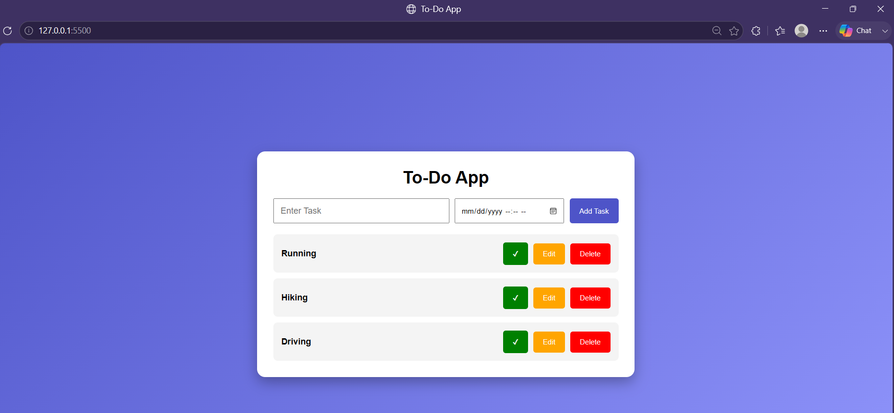

# 📝 To-Do Web Application

A simple, responsive, and user-friendly **To-Do Web Application** built using **HTML, CSS, and JavaScript**. This application helps users efficiently manage daily tasks by allowing them to add, edit, delete, and organize tasks with due dates and completion status.

---

## 📌 Features

- ➕ Add new tasks
- ✏️ Edit existing tasks
- 🗑️ Delete tasks
- ✅ Mark tasks as completed
- 📅 Set due date and time
- 💾 Stores tasks using Local Storage
- 📱 Fully responsive design
- 🎨 Clean and modern user interface

---

## 🛠️ Technologies Used

- HTML5
- CSS3
- JavaScript (ES6)
- Local Storage API

---

## 📂 Project Structure

```
ToDo-App/
│── index.html
│── style.css
│── script.js
│── README.md
│
└── images/
    └── todo.png
```

---

## 🚀 Getting Started

### 1. Clone the repository

```bash
git clone https://github.com/bhagatraj12/SCT_WD_4.git
```

### 2. Open the project

Open the project folder in **Visual Studio Code**.

### 3. Run the application

Open `index.html` directly in your browser

**OR**

Use the **Live Server** extension in VS Code.

---

## 📸 Project Screenshot



---

## 💻 How It Works

1. Enter a task in the input field.
2. Select the due date and time.
3. Click the **Add Task** button.
4. View all added tasks in the task list.
5. Edit or delete tasks whenever needed.
6. Mark tasks as completed after finishing them.
7. Tasks are automatically saved in the browser using Local Storage.

---

## 🌟 Future Enhancements

- 🔍 Search tasks
- 📂 Filter by Completed/Pending
- ⭐ Task Priority (High, Medium, Low)
- 🌙 Dark Mode
- 🔔 Notification reminders
- 📊 Task statistics dashboard
- 📌 Drag and Drop task reordering

---

## 📖 Learning Outcomes

This project demonstrates:

- DOM Manipulation
- Event Handling
- JavaScript Functions
- Local Storage API
- Responsive Web Design
- CRUD Operations
- UI Design Principles

---

## 👨‍💻 Author

**Bhagat Raj**

GitHub: https://github.com/bhagatraj12

---

## 📄 License

This project is developed for educational and internship purposes.
